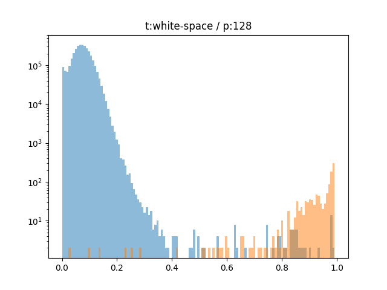

# 🦜🦜 Co-Pietje - Finding near duplicates in a set of documents.

When dealing with large collections of documents, as is common in digital forensics and e-discovery, it is often
necessary to detect and process duplicate documents. The aim of this project is to perform near-duplicate document
detection. This means that, in addition to exact copies that are byte-for-byte identical, we are also interested in
detecting for example:

 * Text derived from a different file format version of the same document
 * Scanned copies of documents with OCR errors
 * Previous/later versions of the same document with minor edits and revisions

## 🔌 Installation

Clone this repository, then install the tool using pip:

```bash
$ pip install .
```

## 🚀 Usage

### Downloading and hashing data from Hansken

The first step is to download the documents from Hansken. This also performs all per-document operations, including
MinHashing, and stores the results in a database.

The following command will download the documents in the Hansken project with project ID
11111111-aaaa-bbbb-2222-345678901234 and store them in the directory `output_dir`.
It will store the document metadata and MinHash hashes in the database `output_dir/casename.db`.

```bash
$ copietje download --endpoint 'https://hansken.internal/gatekeeper/' \
                    --keystore 'https://hansken.internal/keystore/' \
                    11111111-aaaa-bbbb-2222-345678901234 \
                    ./output_dir/casename.db
```

You will be prompted for your Hansken credentials.
Contact your Hansken administrator if you are unsure about the URLs for your Hansken installation.

The `copietje download` command has many options that are documented in the subcommand's help function:

```bash
$ copietje download --help
```

### Matching similar documents

Once the documents have been downloaded and processed, the matching process can start.
You can use the `copietje match` subcommand to find the near-duplicates in the document database
and output them:

```bash
$ copietje match /output_dir/casename.db > duplicates.txt
```

The `copietje match` command has many options that are documented in the subcommand's help function:

```bash
$ copietje match --help
```


## 🦜 Detecting near-duplicates using MinHash and LSH

Detecting similar (portions of) documents is a task that is often necessary when working with large document
collections. Applications include search engine operation (Broder, 2000), language model training (Lee, 2021)
and plagiarism detection (Karnalim, 2023).

We can express how similar objects are by comparing their similarities and their differences. More formally, if we
regard documents as sets in the mathematical sense, where the members of the sets are sequences of characters or words,
we can express their similarity as the ratio of the intersection and the union of the sets.
If documents share many text sequences, they are similar.
If there are many text sequences that are not shared between the documents, they are dissimilar.
This is known as Intersection over Union (IoU) or Jaccard similarity of a pair of documents.

|   |
|--------------------------------------------------------------------------------|
| **Figure:** Graphical explanation of Intersection over Union                   |


Computing this value directly involves performing many computations per document, and comparing all possible pairs of
documents. This is prohibitive in terms of computing time and storage requirements as the document collection size
increases.
The industry standard solution for this problem was first proposed in 1997 by Andrei Broder, a DEC engineer
working on the Altavista search engine (Broder, 1997) and is known as MinHash.
The main idea of MinHash is to sample the items in the sets in such a way that we can obtain an approximation
of the Jaccard similarity of the documents by comparing their samples instead of the entire sets.

However, this approach alone would still require the program to iterate through all possible pairs of documents,
leading to a combinatorial explosion. MinHash is therefore often combined with an implementation of Locality-Sensitive
Hashing (LSH), a technique for approximate search (Andoni, 2008). LSH further hashes the MinHash sets into bins so that
similar sets are more likely to end up in the same bin. (Near) duplicates of a document can then be found by retrieving
the documents in its bin.
LSH is a probabilistic data structure, with tunable parameters that control the probability of spurious matches
(also known as false positives) and missed matches (also known as false negatives).

A good overview of MinHash and LSH is available in [chapter 3](http://infolab.stanford.edu/~ullman/mmds/ch3n.pdf) of
the book Mining of Massive Datasets (Leskovec, 2020).

This project uses the [datasketch implementation](https://github.com/ekzhu/datasketch) of both the MinHash LSH and the MinHash itself.


## ⚠️ Assumptions, caveats and limitations

The central assumption of the method is that document similarity can be determined using operations on the text of the
document. This assumption is not unreasonable, but it does not hold universally.
For example, for documents that are composed mainly of images that don't contain text, this method would not work, because
the images could be the same, or they could be very different. The method described here has no way to tell the difference.
Another example are things like forms and invoices.
They contain a lot of common text that will lead to high similarity scores, regardless of the generally more
meaningful bits of the form, like values of a form's fields or the recipient of an invoice.

Since the problem of directly comparing a large number of text documents is numerically intractable, we are using a
number of abstractions and approximations to enable the software in this repository to perform the task of finding
similar documents.

The main approximation is the use of MinHash to estimate the pairwise Jaccard similarity scores.
MinHash has been shown (Shrivastava, 2014) to outperform alternatives both in high-similarity and
low-similarity comparisons.

LSH performs approximate similarity queries. The default LSH parameters are tuned to penalize false
negative results more strongly than false positives.
False positive LSH results are increased due to this parameter selection, but they are detected
and eliminated from the result set later in the process by computing the MinHash approximation of the Jaccard
similarity and applying the threshold value.


## 📻 Parameters and default values

The implementation of the MinHash algorithm in this project is dependent on a number of parameters.
Experiments have been performed on a hand-selected subset of the NewsEdit dataset (Spangher, 2022).
The code used to perform the experiments is included with the project in the `experiments` folder.

|                                                                                                                                                            |
|--------------------------------------------------------------------------------------------------------------------------------------------------------------------------------------------------------------------------------------------------|
| **Figure:** An example of experimental results. The aim is to separate the orange section (comparisons between similar documents) from the blue section (comparisons between different documents). Note that the vertical scale is logarithmic. |

Different settings for the parameter values have been investigated and the results of the experiments have been used
to select the default values for these parameters.

Parameter values can be adjusted if a different use case requires specific tweaks.

These are the parameters and their default values:

### Normalization
To be able to compare text from different sources, some normalization is performed on the document text.
The default normalization setting removes HTML tags, repairs broken Unicode encodings, transliterates codepoints to
the closest ASCII representation, removes line breaks and punctuation marks and strips away currency symbols.

To use a different normalization, change the second part of the `--condenser` argument for the `download` command (see
[Matching similar documents](#matching-similar-documents)).

The supported options for this parameter are:
- `norm-html`: Remove HTML tags and perform text normalization as described above (default).
- `norm`: Perform text normalization without removing HTML tags.

### Tokenization

Before the MinHash algorithm can be used, the text in a document has to be tokenized. For each of these tokens, a hash and
a number of permutations of that hash is calculated, so the document can be compared based on that.
By default, the text in a document is split on white space to create tokens. To use a different tokenizer, change
the first part of the `--condenser` argument for the `download` command (see [Matching similar documents](#matching-similar-documents)).

The supported options for this parameter are:
- `split_sents` / `sents`: Make tokens based on sentences.
- `split_words` / `words`: Make tokens based on words.
- `white_space` / `ws`: Make tokens based on white space (default).
- `white-space-2-grams`: Make a token for every two sections of characters separated by white space.
- `white-space-3-grams`: Make a token for every three sections of characters separated by white space.
- `white-space-4-grams`: Make a token for every four sections of characters separated by white space.
- `white-space-5-grams`: Make a token for every five sections of characters separated by white space.
- `white-space-6-grams`: Make a token for every six sections of characters separated by white space.
- `1-grams`: Make a token for every character.
- `2-grams`: Make a token for every two characters.
- `3-grams`: Make a token for every three characters.
- `4-grams`: Make a token for every four characters.
- `5-grams`: Make a token for every five characters.
- `6-grams`: Make a token for every six characters.

### Hash function

The datasketch implementation of the MinHash algorithm hashes all tokens to turn them into numeric values for further
processing.
The hash function used does not have to be a cryptographic hash function, and different hash functions
represent different accuracy/performance trade-offs.
The default hash function in this implementation is SHA1, which is also the default in the underlying
[datasketch implementation](https://github.com/ekzhu/datasketch).
This is a conservative choice that prioritizes accuracy at the expense of (slightly) increased run-time.

To use a different hash function, change the third part of the `--condenser` argument for the `download` command (see
[Matching similar documents](#matching-similar-documents)).

The supported options for this parameter are:
- `sha1`: SHA1 (default)
- `mmh3`: MurMurHash3
- `crc32`: CRC32


### Number of permutations

After the hash function is run, a certain number of permutations are made of that hash. This number can be increased to improve
the accuracy of the comparison.
The trade-off for this, however, is the increase of CPU use and memory use, since there
are more permutations to be calculated and stored.
By default, the number of permutations is 128, the same as the underlying [datasketch implementation](https://github.com/ekzhu/datasketch).
To use a different number of permutations, change the fourth part of the `--condenser` argument for the `match` command (see
[Matching similar documents](#matching-similar-documents)).


### LSH threshold

For all MinHashes that were calculated, a MinHash LSH is built (see [Detecting near-duplicates using MinHash and
LSH](#-detecting-near-duplicates-using-minhash-and-lsh)). While building this LSH, a threshold needs to be supplied, to
determine how much of the hashes needs to match to determine that two documents are similar.
By default, this threshold is set to 0.5. This means that half of the hashes of the tokens need to match to exceed this
threshold.
To adjust the threshold, supply a different value for the `--threshold` argument for the `match` command (see
[Matching similar documents](#matching-similar-documents)). This value should be between 0.0 and 1.0.


### LSH weights

While comparing the MinHashes of documents, it is possible to give more importance to false positives or false negatives.
By default, this value is set to 0.75. This means that more relative weight is given to false negatives.
To adjust the threshold, supply a different value for the
`--false-negative-weight` argument for the `match` command (see
[Matching similar documents](#matching-similar-documents)). This value should be between 0.0 and 1.0.


## 🐘 Processing digital evidence with Hansken

This project is intended to work in tandem with [Hansken](https://www.hansken.nl/), the digital forensics platform
developed at the [Netherlands Forensic Institute](https://www.forensischinstituut.nl/).
More information about Hansken is available in the
[Hansken professional appendix](https://www.forensischinstituut.nl/over-het-nfi/publicaties/publicaties/2020/12/02/vakbijlage-hansken)
(in Dutch) and on the Hansken website.
The project can also be used as a stand-alone implementation for locally stored documents or be integrated
into other forensics/e-discovery/document management systems.


## 📚 References

 - Andoni, Alexandr, and Piotr Indyk. "Near-optimal hashing algorithms for approximate nearest neighbor in high dimensions." Communications of the ACM 51.1 (2008): 117-122.
 - Broder, Andrei Z. "On the resemblance and containment of documents." Proceedings. Compression and Complexity of SEQUENCES 1997 (Cat. No. 97TB100171). IEEE, 1997.
 - Broder, Andrei Z. "Identifying and filtering near-duplicate documents." Annual symposium on combinatorial pattern matching. Berlin, Heidelberg: Springer Berlin Heidelberg, 2000.
 - Karnalim, Oscar. "Identifying Code Plagiarism on C# Assignments." 2023 IEEE International Conference on Advanced Learning Technologies (ICALT). IEEE, 2023.
 - Lee, Katherine, et al. "Deduplicating training data makes language models better." arXiv preprint arXiv:2107.06499 (2021).
 - Leskovec, Jure, Anand Rajaraman, and Jeffrey David Ullman. Mining of massive data sets. Cambridge university press, 2020.
 - Shrivastava, Anshumali, and Ping Li. "In defense of minhash over simhash." Artificial Intelligence and Statistics. PMLR, 2014.
 - Spangher, Alexander, et al. "Newsedits: A news article revision dataset and a novel document-level reasoning challenge." Proceedings of the 2022 Conference of the North American Chapter of the Association for Computational Linguistics: Human Language Technologies. 2022.
